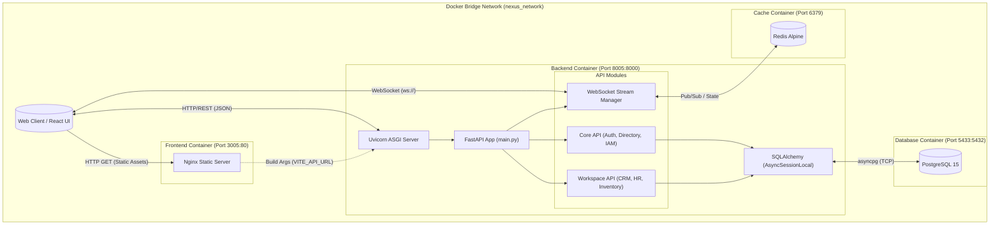

# B-Core Nexus (V1 Beta) - System Design & Architecture

## 1. High-Level Architecture Overview

B-Core Nexus is designed as a headless, code-first ERP core utilizing a decoupled modern tech stack. The system is containerized using Docker, providing clear isolation between the frontend, backend, and data persistence layers.

**Core Technology Stack:**
*   **Client Layer:** React 19 single-page application built with Vite, utilizing React Router for navigation, `@tanstack/react-virtual` for high-performance DOM virtualization, and WebSockets for real-time updates.
*   **API Gateway / Backend:** FastAPI (Python) serving as an asynchronous API layer (`uvicorn`). It handles routing, middleware (CORS, Request ID injection, Logging), and WebSocket stream management.
*   **Data Persistence:** PostgreSQL 15 accessed asynchronously via SQLAlchemy (`asyncpg`) and Alembic for schema migrations.
*   **Caching & Pub/Sub:** Redis (Alpine) used for high-speed in-memory operations and WebSocket Pub/Sub state management.
*   **Infrastructure:** Docker Compose orchestrating an isolated bridge network (`nexus_network`) connecting `frontend`, `backend`, `db`, and `redis` services.

The backend is logically divided into an **Immutable Core Layer** (Auth, Directory, Catalog, IAM) and a **Pluggable Workspace Layer** (CRM, Inventory, HR, Operations, Finance).

---

## 2. System Architecture Diagram



---

## 3. Data Flow Model

### Standard Transaction Flow (e.g., Creating a Directory Entity)

1.  **Client Request:** The user submits a form in the React frontend. The client generates an HTTP POST request targeting `/api/v1/directory` via `fetch()`.
2.  **API Ingestion:** The request hits the FastAPI `uvicorn` server inside the `backend` container.
3.  **Middleware Execution:** The `context_and_logging_middleware` intercepts the request, injects a unique UUID (`X-Request-ID`), and starts a timer.
4.  **Routing & Authentication:** FastAPI routes the request to the `directory_router`. The route dependency validates the JWT token against the `SECRET_KEY`.
5.  **Database Transaction:** 
    *   The route requests an `AsyncSessionLocal` from the database pool.
    *   The business logic constructs a `DirectoryProfile` SQLAlchemy object.
    *   SQLAlchemy translates this into an async SQL `INSERT` statement via `asyncpg` to the PostgreSQL container.
6.  **Real-Time Broadcast (Optional):** If the creation triggers an event, `ws_manager` publishes a notification payload to the Redis container.
7.  **Response:** 
    *   The database confirms the commit.
    *   The middleware logs the total request duration.
    *   FastAPI returns a `201 Created` or `200 OK` JSON response to the client.
    *   Connected WebSocket clients receive the update event via Redis.

---

## 4. Current Bottlenecks & Tech Debt

Based on the architectural codebase audit, the following critical deviations from enterprise Domain-Driven Design (DDD) and scalability best practices exist:

### A. Tightly Coupled Backend Modules (Anti-DDD Pattern)
In `backend/app/main.py`, there is a forced eager import block for models:
```python
# ─── Eagerly import all models so SQLAlchemy mapper relationships configure
# correctly before the first request (prevents 'Department not found' errors)
from app.models.organization import Department, Organization
from app.workspaces.crm.models import Customer, Contact...
```
**Issue:** This explicitly violates Domain-Driven Design. The "Immutable Core" is tightly coupled to the "Pluggable Workspace Layer" (CRM, Organization). A pluggable architecture should dynamically discover models or register them via decoupled registries without forcing the root entry point to know about domain-specific entities.

### B. Global Catch-All Exception Swallowing
The global `SQLAlchemyError` handler in `main.py` intercepts all database integrity exceptions and transforms them into a generic `500 Database Integrity Error`.
**Issue:** This masks underlying data corruption, constraint violations (e.g., duplicate unique IDs), or missing relations. It hinders debugging and prevents specific workspaces from gracefully handling their own business logic failures (like a duplicate email in CRM). 

### C. Monolithic Frontend Anti-Pattern
`frontend/src/App.jsx` is a massive monolithic file (900+ lines) handling:
*   Offline state caching (`localStorage`).
*   Global WebSocket state.
*   Multiple UI views (Directory, Catalog, Virtualization).
*   Mock Data seeding.
**Issue:** This tightly couples view logic, state management, and API bridging into a single component. It needs to be refactored into modular components, dedicated service classes for API calls, and context/Zustand slices for state management.

### D. Blocking Middleware Anti-Pattern
While minor, the `context_and_logging_middleware` uses synchronous implementations (`uuid.uuid4()` and `json.dumps()`) within the async request path. Under heavy load, mixing sync CPU-bound serialization inside the main async event loop can degrade concurrent connection performance.
