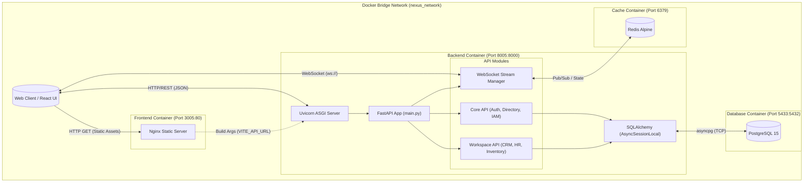

# B-Core Nexus (V1 Beta) - System Design & Architecture

## 1. High-Level Architecture Overview

B-Core Nexus is designed as a headless, code-first ERP core utilizing a decoupled modern tech stack. The system is containerized using Docker, providing clear isolation between the frontend, backend, and data persistence layers.

**Core Technology Stack:**
*   **Client Layer:** React 19 single-page application built with Vite, utilizing React Router for navigation, `@tanstack/react-virtual` for high-performance DOM virtualization, and WebSockets for real-time updates.
*   **API Gateway / Backend:** FastAPI (Python) serving as an asynchronous API layer (`uvicorn`). It handles routing, middleware (CORS, Request ID injection, Logging), and WebSocket stream management.
*   **Data Persistence:** PostgreSQL 15 accessed asynchronously via SQLAlchemy (`asyncpg`) and Alembic for schema migrations.
*   **Caching & Pub/Sub:** Redis (Alpine) used for high-speed in-memory operations and WebSocket Pub/Sub state management.
*   **Infrastructure:** Docker Compose orchestrating an isolated bridge network (`nexus_network`) connecting `frontend`, `backend`, `db`, and `redis` services.

The backend is logically divided into an **Immutable Core Layer** (Auth, Directory, Catalog, IAM) and a **Pluggable Workspace Layer** (CRM, Inventory, HR, Operations, Finance).

---

## 2. System Architecture Diagram

---

## 3. Data Flow Model

### Standard Transaction Flow (e.g., Creating a Directory Entity)

1.  **Client Request:** The user submits a form in the React frontend. The client generates an HTTP POST request targeting `/api/v1/directory` via `fetch()`.
2.  **API Ingestion:** The request hits the FastAPI `uvicorn` server inside the `backend` container.
3.  **Middleware Execution:** The `context_and_logging_middleware` intercepts the request, injects a unique UUID (`X-Request-ID`), and starts a timer.
4.  **Routing & Authentication:** FastAPI routes the request to the `directory_router`. The route dependency validates the JWT token against the `SECRET_KEY`.
5.  **Database Transaction:** 
    *   The route requests an `AsyncSessionLocal` from the database pool.
    *   The business logic constructs a `DirectoryProfile` SQLAlchemy object.
    *   SQLAlchemy translates this into an async SQL `INSERT` statement via `asyncpg` to the PostgreSQL container.
6.  **Real-Time Broadcast (Optional):** If the creation triggers an event, `ws_manager` publishes a notification payload to the Redis container.
7.  **Response:** 
    *   The database confirms the commit.
    *   The middleware logs the total request duration.
    *   FastAPI returns a `201 Created` or `200 OK` JSON response to the client.
    *   Connected WebSocket clients receive the update event via Redis.

---

## 4. Resolved Tech Debt (DDD Alignment Completed)

During the beta phase, several architectural deviations were identified and subsequently resolved to enforce strict Domain-Driven Design (DDD) and scalability:

### A. Decoupled Backend Modules (True Pluggability)
**Resolved:** The eager imports of workspace-specific models in `main.py` were removed. The system now uses a dynamic model loader (`app.core.workspace.loader.load_workspace_models`) ensuring the Immutable Core remains entirely decoupled from the Pluggable Workspace Layer.

### B. Granular Exception Handling
**Resolved:** The global `SQLAlchemyError` catch-all was replaced with specific handlers for `IntegrityError` and `DataError`. The backend now gracefully parses underlying PostgreSQL constraints (e.g., unique violations, missing foreign keys) and returns actionable `409` or `422` HTTP responses, allowing the frontend to display precise validation errors.

### C. Modular Frontend Architecture
**Resolved:** The monolithic `App.jsx` file was refactored. View logic, state management, and API bridging are now split into dedicated directories (`/context`, `/providers`, `/routes`, `/layouts`, `/pages`). `App.jsx` now acts solely as a root provider wrapper.

### D. Non-Blocking Async Middleware
**Resolved:** The synchronous bottlenecks in `context_and_logging_middleware` were optimized. Request IDs are now generated via fast `os.urandom(16).hex()`, and JSON serialization for logging has been offloaded to a non-blocking background thread via `QueueHandler` and `QueueListener`.
