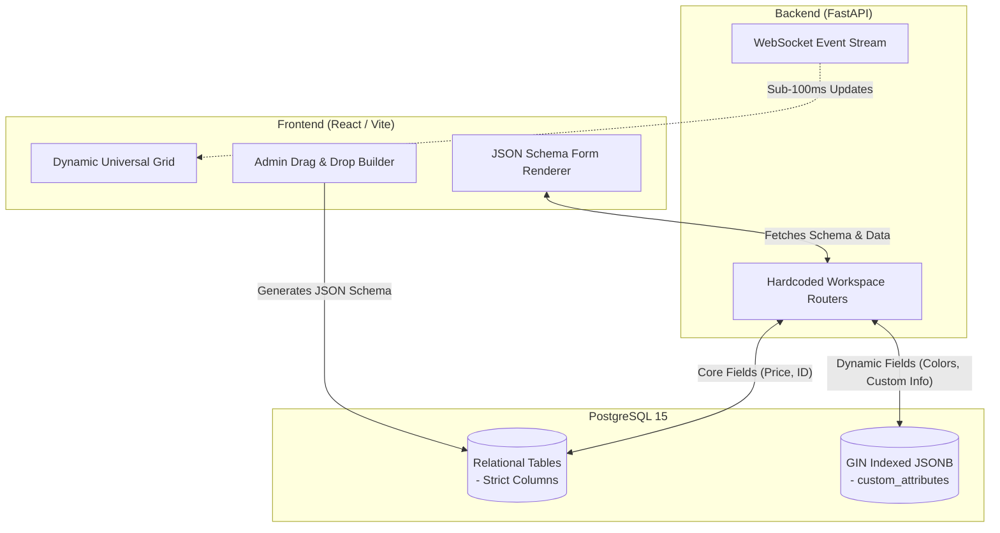

# B-Core Nexus V1 Beta: System Design & Architecture
**Status**: Proposed for V1 Beta Release  
**Author**: Antigravity Architecture Team  

> [!TIP]
> **Executive Summary**
> B-Core Nexus is an enterprise-grade ERP core engineered to outperform traditional legacy systems like Odoo and ERPNext. It utilizes a **Hybrid Architecture**: core financial and operational workflows are hardcoded in high-speed asynchronous Python (FastAPI), while a dynamic, JSONB-backed metadata engine allows for zero-downtime, drag-and-drop form extensibility via the admin panel. 

---

## 1. Context & Scope
With the V1 Beta release scheduled in 3 days, the system must bridge the gap between "rigid, custom-built performance" and "SaaS-level extensibility." The single-client deployment must lay the foundation for a massively scalable platform. 

This document outlines the **Hybrid Metadata / Code-First Engine** and details the core hardcoded workspace workflows.

### Goals
- **Blistering Performance**: Sub-100ms API response times utilizing FastAPI and `asyncpg`.
- **Zero-Downtime Extensibility**: Allow Tier 1 Admins to add fields to any workspace form via a UI drag-and-drop builder without requiring backend code deployments.
- **Strict Data Integrity**: Maintain absolute relational integrity for ledgers, stock, and critical business data.

### Non-Goals
- Allowing business users to write dynamic backend code (no Python execution in the browser).
- Multi-tenancy via Row-Level Security (we maintain container-isolated deployments).

---

## 2. High-Level Architecture: The Hybrid Engine

To beat Odoo and ERPNext, we split the data model into two halves: **The Rigid Core** and **The Elastic Shell**.

### 2.1 The Metadata Engine (The "ERPNext Killer")
1. **Schema Generation**: The Admin Panel's drag-and-drop builder saves a UI layout as a JSON Schema in the `system_settings` table.
2. **Dynamic Rendering**: The React frontend reads this schema and renders the form dynamically.
3. **Data Persistence**: Any data entered into these dynamic fields is packed into the `custom_attributes` JSONB payload.
4. **Searchability**: PostgreSQL GIN indexing allows millions of records to be searched by arbitrary JSON fields instantly.

---

## 3. Workspace Workflows (Hardcoded & High-Velocity)

While custom fields are dynamic, the **Core Workflows** must remain hardcoded in Python to ensure transactional safety and high-speed execution.

### 3.1 CRM Workflow: Quote to Cash

```mermaid
sequenceDiagram
    participant User
    participant CRM
    participant Finance
    participant Inventory
    
    User->>CRM: 1. Convert Quote to Sales Order
    CRM->>CRM: 2. Lock Order (Status: Confirmed)
    User->>CRM: 3. Trigger "Fulfill Order"
    
    rect rgb(30, 40, 50)
    Note over CRM,Inventory: Async Transaction Block (Commit/Rollback together)
    CRM->>Inventory: 4. Deduct Stock (Generate Stock Ledger OUT)
    Inventory-->>CRM: Stock Verified (await db.flush)
    CRM->>Finance: 5. Generate Journal Entry (Debit AR, Credit Revenue)
    Finance-->>CRM: Balance Verified (await db.flush)
    end
    
    CRM->>User: 6. Broadcast via WebSocket (Order Fulfilled!)
```

### 3.2 Inventory Workflow: Immutable Stock Ledger
> [!IMPORTANT]
> **Stock Ledger Invariant**: Inventory quantities are NEVER updated directly (e.g., `UPDATE items SET qty = 10`). They are calculated entirely by summing the `inv_stock_ledger` table.

*   **Workflow**: When receiving goods, the system generates an `IN` ledger entry. When shipping, an `OUT` entry.
*   **Performance**: The frontend utilizes TanStack Virtual to render live stock positions, while the backend uses PostgreSQL materialized views to cache current stock levels based on the immutable ledger.

### 3.3 Finance Workflow: Double-Entry Guarantee
*   **Workflow**: Every financial movement (Invoice, Payment, Stock adjustment) creates a `fin_journal_entry` with associated `fin_journal_entry_lines`.
*   **The Guardrail**: The Pydantic schemas enforce `@model_validator` logic ensuring `Sum(Debits) == Sum(Credits)` before the request even reaches the database. If it fails, the API instantly rejects the payload with a `422 Unprocessable Entity`.

### 3.4 Operations & Emergency Beacons (Tier 4 to Tier 1)
*   **Workflow**: A machine operator (Tier 4) taps "Machine Broken" on a tablet.
*   **Event Loop**: The system fires a WebSocket `BLOCKER_BEACON` payload. The `operations` router flags the Asset as blocked. 
*   **Resolution**: Executive Dashboards (Tier 1 & 2) flash red. Only a supervisor can unlock the asset, which logs an immutable audit trail in `event_logs`.

---

## 4. Tech Debt Resolved for Beta

The following architectural improvements were successfully implemented to guarantee a flawless Beta:

1. **Decoupled `main.py`**: Eager loading of workspace models was removed and replaced with a dynamic module registry (`load_workspace_models`), making workspaces truly pluggable.
2. **Exception Granularity**: The global catch-all was replaced with robust `IntegrityError` and `DataError` handlers, parsing PostgreSQL constraints into actionable 409/422 UI alerts.
3. **Frontend Modularity**: The `App.jsx` monolith was successfully broken down into scalable feature-slices (Context, Layouts, Providers, Routes) to support the upcoming Drag-and-Drop Builder.
4. **Optimized Middleware**: Blocking synchronous calls in the telemetry middleware were offloaded to background threads (`QueueHandler`) for true async performance.

---

> [!NOTE]
> **Next Steps**
> If you approve this design, we will transition into execution mode. Our immediate focus will be decoupling the backend for true pluggability and mapping out the JSON Schema structure for the Admin Form Builder.
