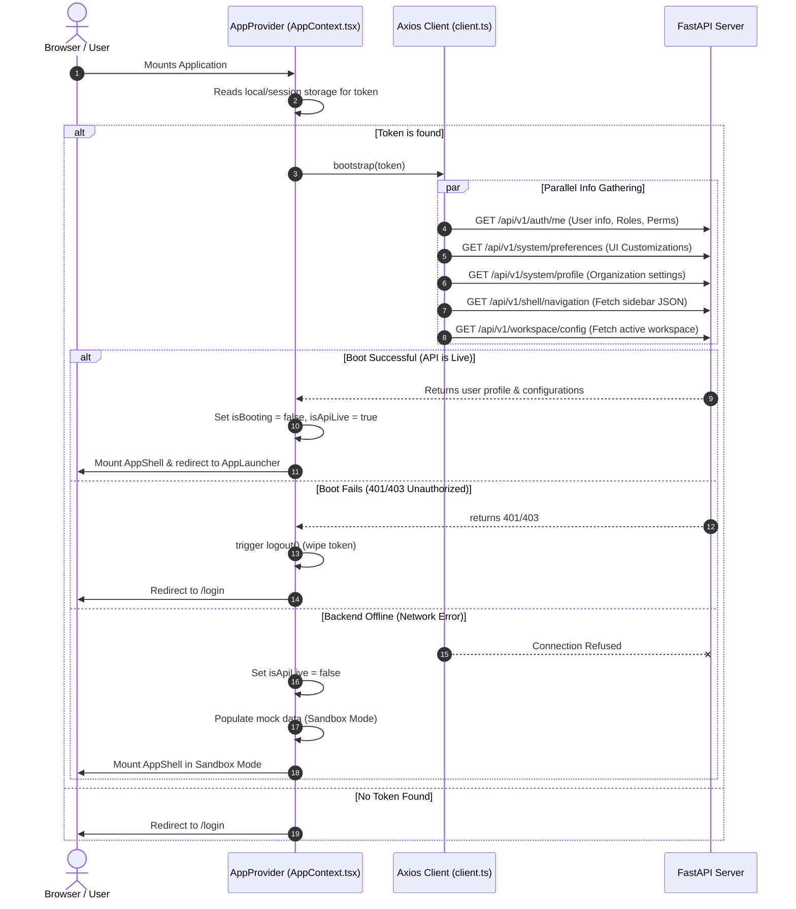
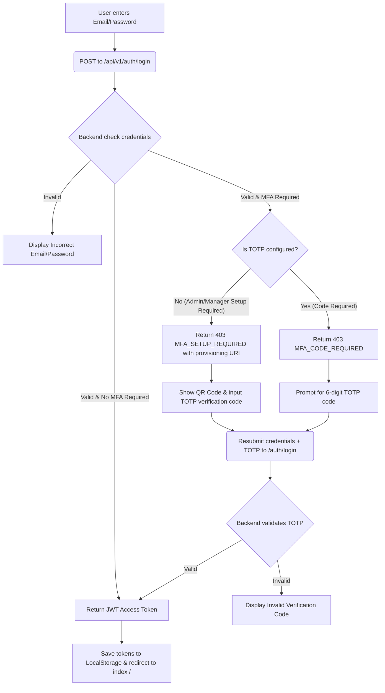
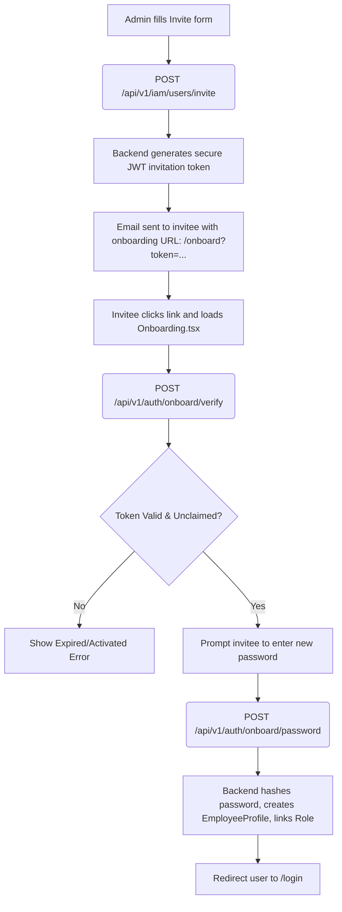
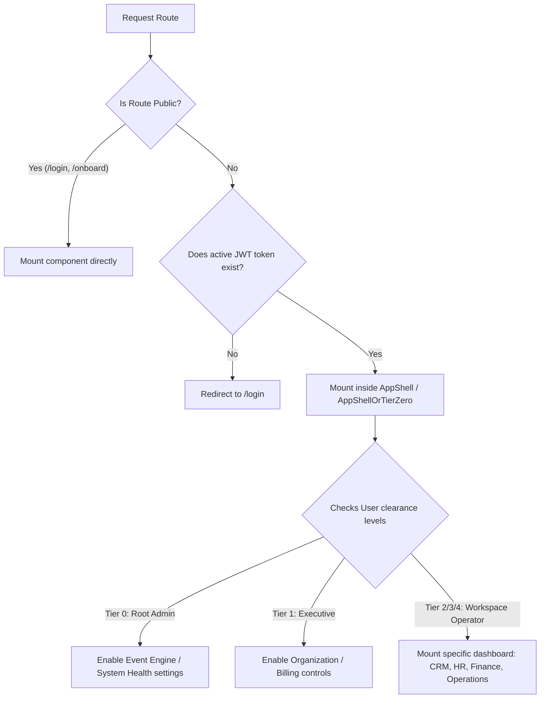

# B-Core Nexus - Frontend Workflow Documentation

This document describes the architectural lifecycle and execution workflows of the **B-Core Nexus React Frontend**. A developer reading this will understand how the client starts up, authenticates users, receives real-time updates, and manages workspace routing.

---

## 1. Application Startup & Bootstrapping Workflow

When a user loads the B-Core Nexus web application, the frontend follows a strict initialization (bootstrapping) sequence managed by [AppProvider](file:///c:/Users/KUNAL/OneDrive/Documents/Projects/B-core_Nexus/b-core_nexus/frontend/src/context/AppContext.tsx#L103).

### Bootstrapping Lifecycle Diagram



> [!IMPORTANT]
> If the API server is offline or unreachable, the frontend automatically degrades into **Offline Sandbox Mode**. It populates a local mock sandbox state from `AppContext.tsx` and `Sandbox.tsx` so developers can still interact with the UI without a running backend.

---

## 2. Authentication & MFA Workflow

Authentication is implemented in [Login.tsx](file:///c:/Users/KUNAL/OneDrive/Documents/Projects/B-core_Nexus/b-core_nexus/frontend/src/pages/Login.tsx) and supports dynamic Multi-Factor Authentication (MFA) intercepts.

### Authenticating Flow



> [!NOTE]
> Under the B-Core design system, administrators (`admin`) and system managers (`system_manager`) are forced into mandatory MFA. Other role classes can use optional MFA configurations.

---

## 3. User Onboarding Workflow

New users are registered through a secure onboarding workflow initiated by an admin and completed by the invitee.



---

## 4. Real-time Events & WebSockets Workflow

The application stays synchronized with backend data mutations and system alerts using two WebSocket channels established upon login.

### 1. Global State Mutation Listener
- **Provider**: [useGlobalWebSocket.js](file:///c:/Users/KUNAL/OneDrive/Documents/Projects/B-core_Nexus/b-core_nexus/frontend/src/providers/useGlobalWebSocket.js)
- **Path**: `ws://<host>/api/v1/stream?token=<token>&workspace=<key>`
- **Workflow**:
  1. The client establishes a persistent connection.
  2. When the backend mutates resource state (e.g. invoice updated, leave approved), it broadcasts a `STATE_MUTATION` payload containing details of the change.
  3. The hook catches this and fires a custom DOM event:
     ```javascript
     window.dispatchEvent(new CustomEvent('STATE_MUTATION', { detail: payload }));
     ```
  4. Active components (like [UniversalDataGrid](file:///c:/Users/KUNAL/OneDrive/Documents/Projects/B-core_Nexus/b-core_nexus/frontend/src/components/ui/UniversalDataGrid.tsx)) listen to this event and trigger data re-fetching to update tables in real time.

### 2. Administrative Broadcast Channel
- The legacy `CommandCenter.tsx` component has been removed from the current frontend. Realtime synchronization is now handled through the global state stream in `useGlobalWebSocket.js`.

---

## 5. UI Layouts & Role-Based Access Control (RBAC)

Routing in [AppRouter.tsx](file:///c:/Users/KUNAL/OneDrive/Documents/Projects/B-core_Nexus/b-core_nexus/frontend/src/routes/AppRouter.tsx) enforces security clearance layout boundaries using user permission strings.



### Layout guards mapping
- **`/settings/config`**: Restricts access to System Settings dashboard (`SystemSettingsDashboard.tsx`) using the `system:admin` permission guard.
- **`/executive`**: Restricts access to Executive Dashboard (`ExecutiveDashboard.tsx`) using the `organization:write` or `iam:manage` roles.
- **`/users` & `/roles`**: Restricted by layout check ensuring user has the `"iam:manage"` capability.
